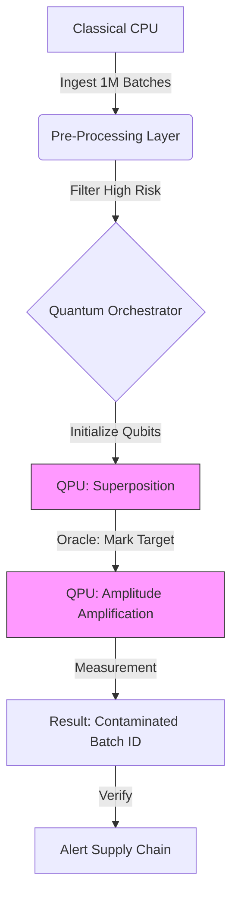

# ⚛️ QuantumReady: The Enterprise Quantum Bridge
> **"Don't just guess if you need Quantum. Prove it."**

[](https://opensource.org/licenses/MIT)
[](https://github.com/BeastAyyG/quantum-ready-demo/releases/latest)
[](https://quantum-ready-demo.vercel.app/quantum-demo.html)
[](https://quantum-ready-demo.vercel.app)

---

## 🚀 The Problem: "The Quantum Hype Gap"
CTOs are hearing about Quantum Computing every day, but:
1.  They don't know **when** to use it.
2.  They don't know **how** to integrate it.
3.  They waste millions on R&D for problems a laptop could solve.

**QuantumReady** bridges this gap with a **Dual-Engine approach**:

| 🧠 Engine 1: AI Analyst | ⚛️ Engine 2: Quantum Simulator |
| :--- | :--- |
| Analyzes business data (CSV/JSON/SQL). | Runs actual quantum circuits (Qubits & Gates). |
| Calculates a **Suitability Score (0-100)**. | Proves speedup with **Grover's Algorithm**. |
| Outputs an ROI Roadmap. | Visualizes $O(\sqrt{N})$ advantage. |

---

## 🥛 Live Case Study: Amul Supply Chain
We applied this engine to **Amul Dairy's** massive supply chain to trace bacterial contamination in raw milk.

### The Challenge
*   **Data:** Millions of milk batches.
*   **Goal:** Find the specific contaminated batch ID causing an alert.
*   **Classical Issue:** Linear Search ($O(N)$) is too slow for real-time perishables.

### The Solution: Quantum Grover Search
We built a **Live 3-Qubit Simulator** to demonstrate the speedup.



---

## ⚡ Speed Comparison
Why use Quantum? Because the math doesn't lie.

| Feature | 🐢 Classical Search | 🚀 Quantum Search (Grover) |
| :--- | :--- | :--- |
| **Complexity** | $O(N)$ (Linear) | $O(\sqrt{N})$ (Quadratic) |
| **Avg Steps (8 Items)** | 4 Steps | **2 Steps** |
| **Avg Steps (1M Items)** | 500,000 Steps | **1,000 Steps** |
| **Strategy** | Check one-by-one | "Magnetize" the needle |

---

## 🛠️ Tech Stack
*   **Frontend:** HTML5, CSS3, Vanilla JS (No bloated frameworks).
*   **Quantum Engine:** Custom `quantum-sim.js` Linear Algebra Engine.
    *   Simulates State Vectors, Hadamard Gates, Oracles, and Diffusion.
*   **Visualization:** Chart.js for probability distribution.

---

## 🏁 Try the Demo
1.  **[Launch the Analyzer](https://quantum-ready-demo.vercel.app)**
2.  Go to **"Live Case Study"**.
3.  Click **"Launch Quantum Simulator"**.
4.  Run the **Classcial vs Quantum Race**.

---

### 👨‍💻 Installation
Want to run the simulator locally?

```bash
# Clone the repo
git clone https://github.com/BeastAyyG/quantum-ready-demo.git

# Navigate to folder
cd quantum-ready-demo

# Run with Python (or any static server)
python3 -m http.server 3000
```
Then open `http://localhost:3000` in your browser.

---

*Built for the Future of Compute. 2026.*
